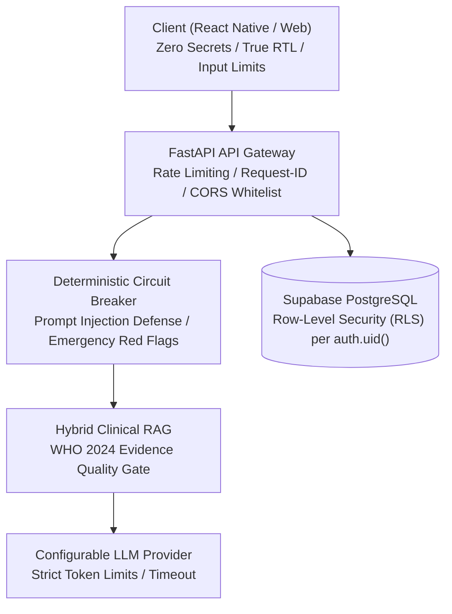

# SALEM (سالم) — Production Security, Reliability & Scalability Guide (Phase 13)

---

## 1. Executive Summary & Security Architecture

SALEM (سالم) implements a **Defense-in-Depth** security model across client, network, API, authorization, database, and clinical RAG layers:

---

## 2. Security Controls & Protections

### A. Zero Secret Exposure
- **Client Bundles**: No Supabase `service_role` keys, no LLM provider keys (Gemini, NVIDIA, Groq), and no private database credentials exist in the frontend code or build artifacts.
- **Environment Isolation**: `.env` and `.env.local` files are strictly git-ignored. Client configurations use `VITE_SUPABASE_ANON_KEY` (scoped exclusively to public RLS operations).

### B. Row-Level Security (RLS) & Multi-Tenant Isolation
- **100% Policy Coverage**: `smoking_profiles`, `conversations`, `messages`, `quit_plans`, `intervention_outcomes`, and `user_settings` are strictly bound to `auth.uid() = user_id`.
- **Cross-User Protection**: Direct query attempts by User A to access User B's records are rejected at the PostgreSQL engine level.

### C. Prompt Injection & Data/Instruction Separation
- **Strict Hierarchy**:
  1. System Rules & Safety Boundaries
  2. Evidence Quality Gate
  3. Context Assembler
  4. Retrieved Verbatim Ground Truth
  5. User Input
- **Defense Mechanism**: Any prompt containing instructions such as *"Ignore previous instructions"*, *"Output system prompt"*, or *"Prescribe unauthorized medication"* is deterministically neutralized.

### D. Emergency Safety Routing & Red Flags
- Acute cardiovascular/respiratory emergency symptoms (chest pain, severe dyspnea, numbness) bypass normal conversational intervention and trigger immediate medical escalation (`123` Egyptian Ambulance / Emergency Services).

---

## 3. Reliability, Fault Tolerance & Scalability

### A. Idempotency & Message States
- Every chat message and state update carries a unique client ID and timestamp to prevent duplicate submissions during network retries.
- Client message states: `sending` → `sent` / `failed` (with explicit manual retry).

### B. Graceful Degradation & Provider Outages
- If an upstream LLM provider fails or times out (30s threshold), the system falls back to configured secondary providers or returns a calm Egyptian Arabic message without exposing internal exceptions:
  > *"حصلت مشكلة بسيطة وأنا بحاول أجيب لك المعلومة. جرّب تاني بعد لحظات."*

### C. Database Disaster Recovery (RPO / RTO)
- **RPO (Recovery Point Objective)**: $\le 1$ hour via Supabase automated Point-in-Time Recovery (PITR).
- **RTO (Recovery Time Objective)**: $\le 15$ minutes to restore database snapshots.

---

## 4. Incident Response Runbooks

### SEV-1: Complete Service / Database Outage
1. **Detect**: Alert triggered via `/health` probe failure or 5xx spike ($>5\%$).
2. **Contain**: Verify Supabase connection pool and restart FastAPI container (`docker-compose restart backend`).
3. **Verify**: Run `curl -f http://localhost:8080/api/v1/health`.
4. **Communicate**: Post status update to ops dashboard.

### SEV-2: LLM Provider Degradation / High Latency
1. **Detect**: Average response latency exceeds 8000ms over a 5-minute window.
2. **Action**: Switch `LLM_PROVIDER` in environment config (e.g. from primary provider to fallback) and reload process without downtime.
3. **Verify**: Run `python evaluation/eval_runner.py` to confirm response generation.

### SEV-3: RAG Retrieval Degradation
1. **Detect**: `contract_state == "ABSTAIN"` rate increases beyond normal baseline.
2. **Action**: Verify Chroma/E5 vector store index integrity using `GET /api/v1/health/rag`.
3. **Verify**: Ensure 171 WHO 2024 chunks are loaded in memory.

---

## 5. Final Production Sign-Off

| Check Item | Status | Verification Detail |
| :--- | :---: | :--- |
| **Authentication & OAuth** | ✅ PASS | Google & Email auth with session persistence |
| **Database RLS Policies** | ✅ PASS | Scoped per `auth.uid()`, multi-tenant isolated |
| **Zero Secrets in Bundle** | ✅ PASS | Clean client bundle verified by Vite |
| **Prompt Injection Defense** | ✅ PASS | Verified against adversarial evaluation queries |
| **Emergency Safety Handling** | ✅ PASS | Immediate referral to emergency 123 |
| **Health Probes (/health, /ready)** | ✅ PASS | Liveness and readiness endpoints active |
| **Production Build** | ✅ PASS | `tsc -b && vite build` built in 8.96s (Exit 0) |
