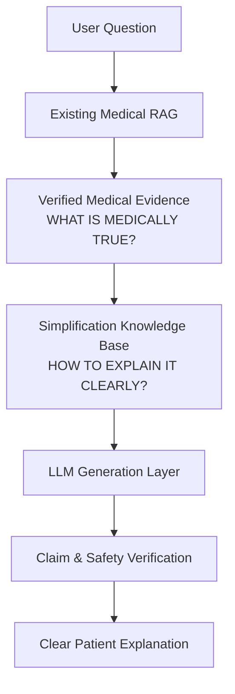

# Source Verification & Legal Licensing Report

## 1. Executive Summary

This report documents the rigorous verification, legal copyright audit, and operational classification of the two primary sources selected for the **Oxygen Medical Simplification Knowledge Base (Phase 1)**:
- **SOURCE-001**: CDC — *Everyday Words for Public Health Communication*
- **SOURCE-002**: CDC — *Clear Communication Index*

---

## 2. Non-Negotiable Architectural Invariant



- **Medical RAG determines:** *"WHAT IS MEDICALLY TRUE?"* (Authoritative medical evidence from PubMed/Guidelines).
- **Simplification Knowledge Base determines:** *"HOW CAN VERIFIED EVIDENCE BE EXPLAINED MORE CLEARLY TO A PATIENT WITHOUT CHANGING ITS MEDICAL MEANING?"*
- ⚠️ **The Simplification Knowledge Base MUST NOT provide medical facts, MUST NOT search for additional treatments, and MUST NOT override or supplement the Medical RAG.**

---

## 3. Official Source Verification & Legal Status

### A. SOURCE-001: CDC Everyday Words for Public Health Communication
- **Source ID**: `SOURCE-001`
- **Exact Title**: *Everyday Words for Public Health Communication*
- **Organization**: Centers for Disease Control and Prevention (CDC), U.S. Department of Health and Human Services (HHS)
- **Official URL**: [https://www.cdc.gov/healthliteracy/researchevaluate/everydaywords.html](https://www.cdc.gov/healthliteracy/researchevaluate/everydaywords.html)
- **Publication Date**: `2015-11-01`
- **Update / Review Date**: `2022-05-09`
- **Document Version**: CDC Health Literacy Reference Edition
- **Source Role**: **PRIMARY SIMPLIFICATION SOURCE**
- **Copyright & License Status**: U.S. Public Domain ([17 U.S.C. § 105](https://www.cdc.gov/other/agencymaterials.html))
- **Commercial Reuse**: **YES** (Permitted under U.S. Federal Government public domain status)
- **Modification / Adaptation**: **YES**
- **Redistribution**: **YES**
- **Attribution**: Recommended standard professional citation
- **Third-Party Content**: **CLEARED** (Text and terminology mapping created entirely by CDC staff)
- **Official Licensing Evidence**: Works prepared by officers and employees of the U.S. Government as part of their official duties are in the public domain. CDC Website Policy explicitly states: *"Most information on the CDC website is in the public domain and may be reproduced or distributed without cost."*

---

### B. SOURCE-002: CDC Clear Communication Index
- **Source ID**: `SOURCE-002`
- **Exact Title**: *The CDC Clear Communication Index: A Tool for Developing and Assessing Public Communication Products*
- **Organization**: Centers for Disease Control and Prevention (CDC), Office of the Associate Director for Communication
- **Official URL**: [https://www.cdc.gov/ccindex/index.html](https://www.cdc.gov/ccindex/index.html)
- **Publication Date**: `2014-09-15` (Foundational Index publication)
- **Update / Review Date**: `2022-05-09` (User Guide online edition)
- **Document Version**: Clear Communication Index User Guide & 20-Item Scorecard
- **Source Role**: **SECONDARY COMMUNICATION QUALITY SOURCE**
- **Copyright & License Status**: U.S. Public Domain ([17 U.S.C. § 105](https://www.cdc.gov/other/agencymaterials.html))
- **Commercial Reuse**: **YES** (Public domain text and scoring criteria)
- **Modification / Adaptation**: **YES**
- **Redistribution**: **YES**
- **Attribution**: Recommended standard professional citation
- **Third-Party Content**: **CLEARED WITH EXCLUSIONS**
  - *Public Domain*: The 20 scored criteria, definitions, and user guide text.
  - *Excluded / Protected*: CDC agency seals, official logos, and third-party stock photos in illustrative sidebars are excluded.
- **Official Licensing Evidence**: Government-authored assessment tool under 17 U.S.C. § 105.

---

## 4. Source Roles & Extraction Boundaries

| Dimension | SOURCE-001 (CDC Everyday Words) | SOURCE-002 (CDC Clear Communication Index) |
| :--- | :--- | :--- |
| **Primary Function** | Vocabulary and phrase-level simplification. | Structural, cognitive, and communicative quality assurance. |
| **Operational Scope** | • Identifying and replacing unnecessary clinical jargon.<br>• Recommending familiar lay words.<br>• Providing dual-context explanations for essential terms. | • Placing the main message first.<br>• Enforcing active voice in behavioral instructions.<br>• Organizing text into short chunks & bulleted lists.<br>• Natural frequency framing for numbers.<br>• Symmetrical benefit/risk balance. |
| **Rule Derivation Policy** | Directly informs lexical `ACTION_RULES`. | Filtered: only actionable rewriting principles become `ACTION_RULES`; document-level scoring rubrics become `EVALUATION_CRITERIA`. |

---

## 5. CDC Clear Communication Index Conversion Audit

Not every CDC Index item is an executable LLM prompt rule. Each of the 20 criteria was evaluated and classified:

```text
CDC Index 20 Scored Items Audit:
├── Core Section:
│   ├── Item 1 (Main message top):         --> ACTION_RULE (RULE-ACT-003)
│   ├── Item 2 (Main message visual):      --> EVALUATION_CRITERION (RULE-EVAL-002)
│   ├── Item 3 (Main message statement):   --> ACTION_RULE (RULE-ACT-003)
│   ├── Item 4 (Visual aids support):      --> EVALUATION_CRITERION (UI Layer)
│   ├── Item 5 (Active voice):             --> ACTION_RULE (RULE-ACT-004)
│   ├── Item 6 (Everyday words):           --> ACTION_RULE (RULE-ACT-001 via SRC-001)
│   ├── Item 7 (Short sections/chunks):    --> ACTION_RULE (RULE-ACT-005)
│   ├── Item 8 (Bulleted/numbered lists):  --> ACTION_RULE (RULE-ACT-005)
│   └── Item 9 (Informative headers):      --> ACTION_RULE (RULE-ACT-005)
├── Behavioral Recommendations:
│   ├── Item 13 (Specific action items):   --> ACTION_RULE (RULE-ACT-008)
│   └── Item 14 (Behavioral clarity):      --> EVALUATION_CRITERION (RULE-EVAL-003)
├── Numbers:
│   ├── Item 15 (Numbers in context):      --> ACTION_RULE (RULE-ACT-006)
│   ├── Item 16 (Natural frequencies):     --> ACTION_RULE (RULE-ACT-006)
│   ├── Item 17 (Simple calculations):     --> ACTION_RULE (RULE-ACT-006)
│   └── Item 18 (Standard whole numbers):  --> ACTION_RULE (RULE-ACT-006)
└── Risk Communication:
    ├── Item 19 (Risk & benefit balance):  --> ACTION_RULE (RULE-ACT-007)
    └── Item 20 (Risk explanation terms):  --> ACTION_RULE (RULE-ACT-007)
```
